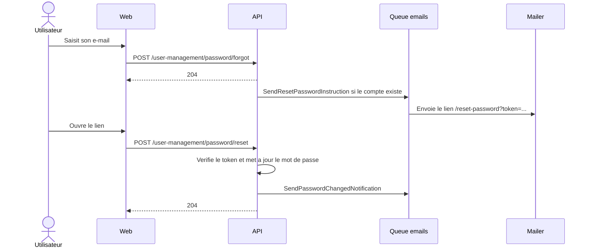

## Surfaces exposees

Backend :

- `POST /user-management/password/forgot`
  - Route nommee `user_management.password.forgot`.
  - Route guest-only avec limitation brute force.
  - Payload : `email`.
  - Reponse : aucun contenu, meme si l'e-mail n'existe pas.
- `POST /user-management/password/reset`
  - Route nommee `user_management.password.reset`.
  - Route guest-only avec limitation brute force.
  - Payload : `token`, `newPassword`.
  - Reponse : aucun contenu.
- `PUT /user-management/password`
  - Route nommee `user_management.password.update`.
  - Route authentifiee avec guard `web`.
  - Payload : `currentPassword`, `newPassword`.
  - Reponse : aucun contenu.

Frontend :

- `/forgot-password` affiche le formulaire de demande d'e-mail.
- `/reset-password?token=...` affiche le formulaire de reinitialisation.
- `/profile/security` affiche le formulaire de changement authentifie.

## Flux de reinitialisation

## Implementation backend

`PasswordService.forgot()` cherche l'utilisateur par e-mail. Si aucun utilisateur n'existe,
le service s'arrete sans erreur. Si l'utilisateur existe, il genere un token chiffre avec :

- purpose `user:reset-password`
- expiration `1h`

Le lien de reinitialisation est construit depuis `FRONTEND_URL` vers `/reset-password`.

`PasswordService.reset()` dechiffre le token, charge l'utilisateur, met a jour son mot de
passe, puis dispatch `SendPasswordChangedNotification`.

`PasswordService.update()` verifie le mot de passe actuel de l'utilisateur connecte. En cas
d'echec, il lance `E_INVALID_CREDENTIALS`. En cas de succes, il sauvegarde le nouveau mot de
passe, envoie la notification, puis ferme la session `web`.

## Jobs et e-mails

Les jobs utilisent la queue `emails` :

- `SendResetPasswordInstruction` envoie l'e-mail de reinitialisation.
- `SendPasswordChangedNotification` envoie l'e-mail de notification de changement.

Les e-mails sont rendus par les classes mail et les templates Edge colocates dans la feature.

## Comportement front

Les trois formulaires utilisent `useAppForm` avec validation Zod cote client.

- La demande de reinitialisation valide le format e-mail.
- La reinitialisation valide la longueur du nouveau mot de passe et la confirmation.
- Le changement authentifie valide le mot de passe courant, la longueur du nouveau mot de passe et la confirmation.

Les mutations passent par `api.userManagement.password.*`.

En cas de succes :

- `forgot` affiche un toast puis navigue vers `/login`.
- `reset` affiche un toast puis navigue vers `/login`.
- `update` affiche un toast, supprime le cache du profil courant, puis navigue vers `/login`.

## Erreurs et securite

- `E_GUEST_ONLY` protege les routes invitees contre les utilisateurs deja connectes.
- `E_UNAUTHENTICATED` protege le changement de mot de passe authentifie.
- `E_INVALID_TOKEN` couvre les tokens de reinitialisation invalides ou expires.
- `E_INVALID_CREDENTIALS` couvre un mot de passe actuel incorrect.
- `E_TOO_MANY_REQUESTS` peut etre renvoye par la limitation brute force sur les routes invitees.
- Le token de reset est chiffre, limite a l'usage `user:reset-password` et expire au bout d'une heure.

## Tests couverts

- Demande de reset avec e-mail existant : reponse sans contenu et job e-mail pousse.
- Demande de reset avec e-mail absent : reponse sans contenu et aucun job pousse.
- Reset avec token valide : mot de passe remplace et notification envoyee.
- Reset avec token invalide : erreur `E_INVALID_TOKEN`.
- Changement authentifie avec mot de passe courant valide : mot de passe remplace, notification envoyee.
- Changement authentifie avec mot de passe courant invalide : erreur `E_INVALID_CREDENTIALS`.
- Refus des routes invitees pour un utilisateur connecte.
- Refus de la route de changement sans session.
- Rendu et destinataire des e-mails.

## Sources consultees

- `apps/api/src/features/user_management/password/routes.ts`
- `apps/api/src/features/user_management/password/controllers/*.ts`
- `apps/api/src/features/user_management/password/services/password.service.ts`
- `apps/api/src/features/user_management/password/jobs/*.ts`
- `apps/api/src/features/user_management/password/mails/*.ts`
- `apps/api/src/features/user_management/password/controllers/*.e2e.spec.ts`
- `apps/api/src/features/user_management/password/jobs/*.unit.spec.ts`
- `apps/api/src/features/user_management/password/mails/*.unit.spec.ts`
- `apps/web/src/routes/(guest)/(auth)/forgot-password/page.tsx`
- `apps/web/src/routes/(guest)/(auth)/reset-password/page.tsx`
- `apps/web/src/routes/(private)/profile/security/page.tsx`
- `apps/web/src/features/user_management/password/components/*.tsx`
- `apps/web/src/features/user_management/password/hooks/*.ts`
